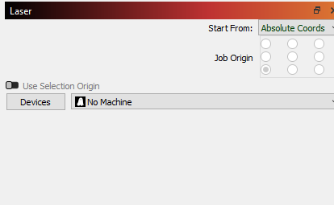

# LightBurn Configuration Guide

This guide explains step-by-step how to configure **LightBurn** for optimal use. The configuration is based on **LightBurn version 1.7.03**.

---

## Table of Contents

1. [Add Device Settings](#step-1-add-device-settings)  
2. [Load Device Configuration](#step-2-load-device-configuration)  
3. [Set Laser Starting Position](#step-3-set-laser-starting-position)  
4. [Adjust Device Settings](#step-4-adjust-device-settings)  
5. [General Settings Configuration](#step-5-general-settings-configuration)  

---

## Step 1: Add Device Settings

1. Open **LightBurn** and navigate to the **Laser** tab on the right-hand side.  
2. Click on **Devices** to open the device configuration window.  
     
3. Use the **Import** button and select the file `device.lbdev` from your repository.  
4. The imported device configuration will:
   - Set a custom workspace with dimensions **300mm x 300mm**.
   - Configure the origin to **front left**.
   - Disable the **auto-home laser on startup** option.
   - Adjust additional parameters:
     - **GCode flavor**: GRBL.
     - **Dwell Units**: Seconds.
     - **S Value Max**: 100.
     - Disable **Tool State Automatic** and **Supports Communication**.
     - Enable **Variable Laser Power**.

---

## Step 2: Load Device Configuration

1. In the **Laser** tab, ensure the correct device (e.g., **Febina**) is selected in the **Devices** dropdown.  
2. This ensures the imported settings are applied to your workspace.  
   

---

## Step 3: Set Laser Starting Position

1. In the **Laser** tab:
   - Set **Start From** to **Current Position**.
   - Set **Job Origin** to **bottom-left**.  
   
2. These settings allow the laser to begin operations from the current physical location.

---

## Step 4: Adjust Device Settings

1. From the top menu, navigate to **Edit** > **Device Settings**.

2. In the **Custom GCode** tab:
   - Replace **Air On (M8)** with `;M8`.
   - Replace **Air Off (M9)** with `;M9`.  
   
3. These changes disable air control commands in the GCode, which is compatible with devices lacking air control functionality.  
4. Save the settings by clicking **OK**.

---

## Step 5: General Settings Configuration

1. Open **Edit** > **Settings**.  

2. In the **Editor Settings** tab:
   - Disable **Automatically check for updates**.  
   
3. In the **Import/Export** tab:
   - Set **Auto-Close Tolerance (mm)** to **0.005**.
   - Set **Curve Tolerance (mm)** to **0.005**.  
   
4. Save changes by clicking **OK**.

---

## Final Notes

- Make sure to double-check all settings after applying changes to ensure compatibility with your specific device.
- These configurations are designed for stable and precise laser operations.

---
